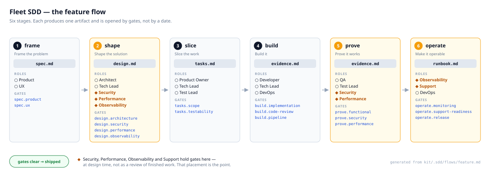
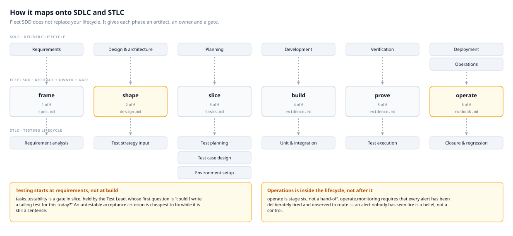
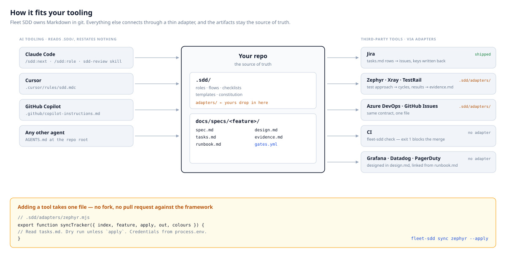
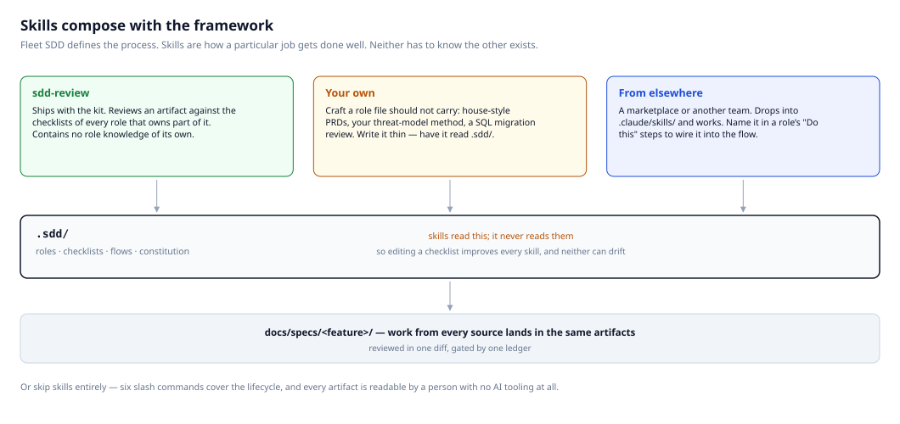

# Fleet SDD

Spec-driven development for a delivery team of thirteen roles — small enough
that they will actually use it.

**Three concepts. One command anyone has to remember. Extend it by dropping a
Markdown file in a folder.**

```bash
npx fleet-sdd init                     # install into your product repo
npx fleet-sdd new "Driver scorecard"   # scaffold a feature
npx fleet-sdd next                     # what is next, and who owns it
```

In Claude Code that last one is `/sdd:next` — and it loads the right role, does
the work, and tells you what still needs a human.

---

## Start here, by role

You do not need to read this whole file. Find your row.

| If you are… | Read this | Then run |
| --- | --- | --- |
| **Product Manager** | [`spec.md` template](kit/.sdd/templates/spec.md) · [role](kit/.sdd/roles/product-manager.md) · [checklist](kit/.sdd/checklists/product-manager.md) | `fleet-sdd new "<title>"` then `next` |
| **UX Designer** | [role](kit/.sdd/roles/ux-designer.md) · [checklist](kit/.sdd/checklists/ux-designer.md) | `fleet-sdd next` — you own `spec.md#experience` |
| **Product Owner / PM** | [role](kit/.sdd/roles/product-owner.md) · [checklist](kit/.sdd/checklists/product-owner.md) | `fleet-sdd status` — the whole board in one screen |
| **Architect** | [role](kit/.sdd/roles/architect.md) · [`design.md` template](kit/.sdd/templates/design.md) | `fleet-sdd next` |
| **Technical Lead** | [role](kit/.sdd/roles/tech-lead.md) · [checklist](kit/.sdd/checklists/tech-lead.md) | `fleet-sdd next` |
| **Developer** | [role](kit/.sdd/roles/developer.md) · [checklist](kit/.sdd/checklists/developer.md) | `fleet-sdd next` — you sign `build.implementation` |
| **Test Lead** | [role](kit/.sdd/roles/test-lead.md) · [checklist](kit/.sdd/checklists/test-lead.md) | `fleet-sdd next` — you gate testability *before* build |
| **QA Engineer** | [role](kit/.sdd/roles/qa-engineer.md) · [checklist](kit/.sdd/checklists/qa-engineer.md) | `fleet-sdd next` |
| **DevOps Engineer** | [role](kit/.sdd/roles/devops-engineer.md) · [`runbook.md` template](kit/.sdd/templates/runbook.md) | `fleet-sdd next` — you are the last gate |
| **Security Engineer** | [role](kit/.sdd/roles/security-engineer.md) · [checklist](kit/.sdd/checklists/security-engineer.md) | `fleet-sdd roles security-engineer` |
| **Performance Engineer** | [role](kit/.sdd/roles/performance-engineer.md) · [checklist](kit/.sdd/checklists/performance-engineer.md) | `fleet-sdd roles performance-engineer` |
| **Observability / SRE** | [role](kit/.sdd/roles/observability-engineer.md) · [checklist](kit/.sdd/checklists/observability-engineer.md) | `fleet-sdd next` — you gate alerts at *design* time |
| **Product Support Lead** | [role](kit/.sdd/roles/support-lead.md) · [checklist](kit/.sdd/checklists/support-lead.md) | `fleet-sdd next` |
| **Platform / framework owner** | [original brief](docs/prompts/00-original-brief.md) · [DESIGN](docs/DESIGN.md) · [decisions](docs/decisions.md) · [authoring](docs/authoring-roles.md) | `npm test` |
| **Just want to see a good one** | [worked example](examples/specs/001-driver-scorecard/) | — |

Not sure which role you are? [docs/roles.md](docs/roles.md) maps common job
titles to role ids.

---

## What it does

Feature work lives in five Markdown files plus a sign-off ledger, in git, in
your repo:

```
docs/specs/001-driver-scorecard/
├─ spec.md        what & why      Product, UX
├─ design.md      how             Architect, Tech Lead, Security, Performance, Observability
├─ tasks.md       slices          Product Owner, Tech Lead, Test Lead
├─ evidence.md    proof           Developer, QA, Test Lead, DevOps
├─ runbook.md     operable        Observability, DevOps, Support
└─ gates.yml      who signed off
```

**Thirteen roles, five files.** Roles own *sections*, not documents — which is
precisely why the spec, the design and the test plan cannot quietly drift apart.

## The flow

<p align="center">
  <a href="docs/diagrams/lifecycle.svg">
    
  </a>
</p>

Arrows are **gates**, not dates. A stage is current when it has gates that are
neither `approved` nor `waived`. Nobody schedules a stage — `fleet-sdd next`
reads the ledger.

> This diagram is **generated from
> [`kit/.sdd/flows/feature.md`](kit/.sdd/flows/feature.md)**, so it cannot drift
> from the flow it documents — add a gate and it grows a row. All four diagrams
> live in [docs/diagrams/](docs/diagrams/); open
> [`docs/diagrams/index.html`](docs/diagrams/index.html) in a browser to see them
> together, or run `npm run diagrams` to rebuild.

## How it maps onto SDLC and STLC

Fleet SDD does not replace your lifecycle. It gives the phases you already run
an artifact, an owner and a gate — so a phase cannot be declared complete
because the calendar says so.

<p align="center">
  <a href="docs/diagrams/sdlc-stlc-mapping.svg">
    
  </a>
</p>

Two things this mapping makes explicit, and they are the reason it is worth
drawing:

- **STLC starts at requirements, not at build.** `tasks.testability` is a gate in
  `slice`, held by the Test Lead, whose first question is *"could I write a
  failing test for this today?"* An untestable acceptance criterion is cheapest
  to fix while it is still a sentence.
- **Operations is inside the lifecycle, not after it.** `operate` is stage six,
  not a hand-off. `operate.monitoring` requires that every alert *has been
  deliberately fired and observed to route*.

## How it fits your tooling

Fleet SDD owns Markdown in git. Everything else connects through a thin adapter,
and the artifacts stay the source of truth.

<p align="center">
  <a href="docs/diagrams/integrations.svg">
    
  </a>
</p>

**How each integration actually works**

| Tool | Direction | Mechanism |
| --- | --- | --- |
| **Jira** | `tasks.md` → issues, keys written back into the `Key` column | Shipped adapter. `fleet-sdd sync jira` — dry run by default, `--apply` to write, credentials from the environment only |
| **Zephyr / Xray / TestRail** | `tasks.md#test-approach` → test cycles; results → `evidence.md` | Drop `.sdd/adapters/zephyr.mjs`. One exported function; see below |
| **Azure DevOps / GitHub Issues** | Same shape as Jira | Same contract |
| **CI** | Blocks a merge on invalid artifacts | `npx fleet-sdd check` — exit 1 on error. Nothing is wired by default, on purpose |
| **Grafana / Datadog / PagerDuty** | Alerts and dashboards are *designed* in `design.md#observability`, then linked from `runbook.md` | No adapter needed. `operate.monitoring` requires each alert be fired and observed to route |
| **Confluence / SharePoint** | Publish the artifacts | They are plain Markdown. Any existing docs pipeline works |

**Adding a tool takes one file.** Adapters resolve by name, repo-local first:

```js
// .sdd/adapters/zephyr.mjs
export function syncTracker({ index, feature, apply, out, colours }) {
  // Read <feature.dir>/tasks.md. Dry run unless `apply`.
  // Credentials from process.env. Return an exit code.
}
```

```bash
npx fleet-sdd sync --list       # shipped + local adapters
npx fleet-sdd sync zephyr       # dry run
npx fleet-sdd sync zephyr --apply
```

No fork, no pull request against this package. Full contract in
[docs/authoring-roles.md](docs/authoring-roles.md#add-a-tracker-adapter).

---

## Skills: bring your own, or write the missing one

Fleet SDD defines *the process*. Skills are *how a particular job gets done
well* — your house style for a PRD, your threat-model method, your query-review
routine. The framework is built so the two compose instead of competing.

<p align="center">
  <a href="docs/diagrams/skills.svg">
    
  </a>
</p>

**1. The one that ships.**
[`sdd-review`](kit/adapters/claude/skills/sdd-review/SKILL.md) reviews any
artifact against the checklists of every role that owns part of it, and reports
what would block each gate. It contains **no role knowledge of its own** — it
reads whatever `.sdd/` currently defines. Edit a checklist and the review
improves; the two cannot drift.

**2. Write the missing one.** When a role's work needs craft the role file
should not carry — "write a PRD in our house voice", "run our threat-model
method", "review a SQL migration" — that is a skill.

```
.claude/skills/threat-model/SKILL.md
```

Write it **thin**: have it read `.sdd/roles/security-engineer.md` and
`.sdd/checklists/security-engineer.md` rather than restating them. Then the role
file stays the single source of truth. Fleet SDD never writes into
`.claude/skills/`, so nothing you put there is ever overwritten.

**3. Bring one from elsewhere.** A skill from a marketplace, another team, or
Anthropic's own set drops straight into `.claude/skills/` and works. To wire it
into the process, name it in the relevant role's `Do this` steps:

```markdown
## Do this
1. Run the `api-design-review` skill against the Interfaces section.
2. Record the outcome in design.md.
```

Now `/sdd:next` will reach it, because agents read the role file. No framework
change.

**4. Or skip skills entirely.** Six slash commands cover the whole lifecycle,
and every artifact is readable by a person with no AI tooling at all.

| Where craft belongs | Put it in |
| --- | --- |
| *What* this role is accountable for, and what it must never sign off | `.sdd/roles/<role>.md` |
| *What to check* before signing a gate | `.sdd/checklists/<role>.md` |
| *How* to do a specialised piece of work well | a skill |
| *Which* artifacts and gates exist at all | `.sdd/flows/<flow>.md` |

More in [docs/authoring-roles.md](docs/authoring-roles.md#add-a-team-prompt-or-skill).

---

## Two ideas worth stealing even if you use nothing else

**Specialists design; they do not inspect.** Security, Performance and
Observability hold gates in the *design* stage, next to architecture. A threat
model, a latency budget and an alert design cost an hour on a whiteboard and a
quarter after release.

**Operability is part of shipping.** The `feature` flow has a sixth stage,
`operate`. `operate.monitoring` requires that every alert has been *deliberately
fired and observed to route* — an alert nobody has seen fire is a belief, not a
control. `operate.support-readiness` requires the people answering customer
questions were briefed *before* release.

## The ledger

`gates.yml` answers the question that otherwise needs a meeting:

```yaml
gates:
  spec.product:        { status: approved,          by: sam@example.com, at: 2026-08-21 }
  design.architecture: { status: pending }
  design.security:     { status: changes-requested, by: dev@example.com, note: "PII in telemetry payload" }
```

And `fleet-sdd next` turns it into one instruction:

```
001-driver-scorecard -- Driver scorecard
flow feature   tier standard   gates 3/17 cleared

Stage    shape -- Shape the solution
Artifact docs/specs/001-driver-scorecard/design.md

Blocked on 2 gate(s):

  design.security            changes-requested  Security Engineer (security-engineer)
    note      PII in telemetry payload
    checklist .sdd/checklists/security-engineer.md
  design.observability       pending            Observability Engineer (observability-engineer)
    checklist .sdd/checklists/observability-engineer.md

Do this next
  /sdd:role security-engineer   or read .sdd/roles/security-engineer.md and work on design.md
```

Waivers are allowed, require a written reason, and stay in the ledger for good.
That is the difference between a decision you can defend and a corner quietly
cut.

## The three concepts

| Concept | Is | Lives in |
| --- | --- | --- |
| **Artifact** | The shared truth | `docs/specs/<nnn-slug>/` |
| **Role** | A lens on artifacts, with gates it may sign | `.sdd/roles/*.md` |
| **Flow** | Ordered stages with gates | `.sdd/flows/*.md` |

There is no fourth concept. That is deliberate.

## Extending it

Adding a role is writing a file. No registration, no code change, no plugin API.

```markdown
---
id: data-engineer
name: Data Engineer
owns: [design.md#data-pipeline]
gates: [design.data-quality]
checklist: checklists/data-engineer.md
---
## Mission
Own the pipeline feeding this feature.
```

Reference the gate from a flow stage and it is live — `fleet-sdd next` routes
work to it, `check` validates it.

| To add | Do this | Guide |
| --- | --- | --- |
| A role | One file in `.sdd/roles/` | [authoring](docs/authoring-roles.md#add-a-role) |
| A gate | Claim it in a role, list it in a stage | [authoring](docs/authoring-roles.md#add-a-gate) |
| A flow | One file in `.sdd/flows/` | [authoring](docs/authoring-roles.md#add-a-flow) |
| A tier | A block in `config.yml` | [authoring](docs/authoring-roles.md#add-a-tier) |
| A skill | A folder in `.claude/skills/` | [authoring](docs/authoring-roles.md#add-a-team-prompt-or-skill) |
| A tracker | One file in `.sdd/adapters/` | [authoring](docs/authoring-roles.md#add-a-tracker-adapter) |
| A change to a shipped file | Copy it to `.sdd/overrides/` — never overwritten | [upgrading](docs/upgrading.md) |

## Commands

```bash
fleet-sdd next [feature]              # what is next, and who owns it
fleet-sdd new "<title>"               # scaffold a feature (--flow, --tier)
fleet-sdd gate <id> <verdict> -m "…"  # approve | request-changes | review | waive | reset
fleet-sdd check [feature]             # validate artifacts and gates; exit 1 on error
fleet-sdd status                      # every feature, its stage and blockers
fleet-sdd roles [id]                  # list discovered roles, or print one
fleet-sdd init                        # install or upgrade the kit here
fleet-sdd doctor                      # install health, local edits, unmerged upgrades
fleet-sdd sync [provider] [--apply]   # push tasks.md to a tracker (dry run by default)
fleet-sdd sync --list                 # adapters available here
```

## Where the teeth are

Templates ship full of `TODO(sdd)` markers, and `check` **fails** if one survives
in an artifact whose stage has been signed off. You cannot silently approve an
empty threat model. `check` also fails on a waiver with no reason, an approval
with no owner, an undeclared gate, and a gate no role can sign.

```bash
fleet-sdd check    # exit 1 on error -- wire it into CI when your team is ready
```

## Works with

| Tool | How |
| --- | --- |
| **Claude Code** | `/sdd:next`, `/sdd:role`, `/sdd:new`, `/sdd:check`, `/sdd:gate`, `/sdd:status`, plus the `sdd-review` skill |
| **Cursor** | `.cursor/rules/sdd.mdc` — `init --adapters=claude,cursor` |
| **Copilot** | `.github/copilot-instructions.md` — `init --adapters=claude,copilot` |
| **Anything else** | `AGENTS.md` at the repo root, the convention every coding agent already reads |
| **People** | It is all Markdown. Read it in GitHub. |

Every adapter is thin — it reads `.sdd/` rather than restating it, so improving
a role file improves every tool at once, and no adapter can drift from the
framework because none contains a copy of it.

---

## All the documents

**Getting started**

| Document | Read it when |
| --- | --- |
| [docs/quickstart.md](docs/quickstart.md) | You have ten minutes and want a feature moving |
| [docs/lifecycle.md](docs/lifecycle.md) | You want to know what each of the six stages produces |
| [docs/roles.md](docs/roles.md) | You want to find your role, or map a job title to one |

**Making it yours**

| Document | Read it when |
| --- | --- |
| [docs/authoring-roles.md](docs/authoring-roles.md) | Adding a role, gate, flow, tier, skill or tracker adapter |
| [kit/.sdd/EXTENDING.md](kit/.sdd/EXTENDING.md) | The short version — ships inside every install |
| [docs/upgrading.md](docs/upgrading.md) | Overrides, the hash manifest, `.new` files, rollback |

**Understanding it**

| Document | Read it when |
| --- | --- |
| [docs/prompts/](docs/prompts/) | You want the prompt that built this — *what was asked for*, versus what was a judgement call |
| [docs/DESIGN.md](docs/DESIGN.md) | You want to know *why* it is built this way before changing it |
| [docs/decisions.md](docs/decisions.md) | You want the reasoning behind a specific choice, and what was rejected |
| [AGENTS.md](AGENTS.md) | You are working *on* the framework |

**Seeing it done**

| Document | Read it when |
| --- | --- |
| [examples/specs/001-driver-scorecard/](examples/specs/001-driver-scorecard/) | You want a complete feature, all 17 gates signed, real notes |
| [examples/README.md](examples/README.md) | You want a guided tour of that example |
| [docs/diagrams/](docs/diagrams/) | You want the four diagrams full size — open `index.html` in a browser |
| [docs/specs/000-fleet-sdd-framework/](docs/specs/000-fleet-sdd-framework/) | Fleet SDD described using Fleet SDD — its own threat model and runbook |

**The kit itself** — all of it is plain Markdown, all of it is meant to be read:

| Path | Contains |
| --- | --- |
| [kit/.sdd/roles/](kit/.sdd/roles/) | Thirteen roles |
| [kit/.sdd/checklists/](kit/.sdd/checklists/) | Thirteen checklists |
| [kit/.sdd/flows/](kit/.sdd/flows/) | `feature`, `bugfix`, `spike` |
| [kit/.sdd/templates/](kit/.sdd/templates/) | The six artifact templates |
| [kit/.sdd/constitution.md](kit/.sdd/constitution.md) | Ten starter principles — **edit this first** |
| [kit/adapters/claude/](kit/adapters/claude/) | Slash commands and the review skill |

## Requirements

Node 16 or later. No dependencies. (`sync --apply` needs Node 18 for `fetch`;
nothing else does.)

## Tests

```bash
npm test
```

43 tests, no mocks — each drives the real CLI against a real install in a
temporary directory, including the worked example and the framework's own spec.

## Lineage

Built on ideas from [spec-kit](https://github.com/github/spec-kit) (artifact
pipeline, template resolution), [BMAD](https://github.com/bmad-code-org/bmad-method)
(role personas, checklists), [GSD](https://github.com/open-gsd/gsd-core)
(verification before done) and [AGENTS.md](https://agents.md) (the portable
entry point). [docs/DESIGN.md](docs/DESIGN.md) records what was taken from each,
and what was deliberately refused.
